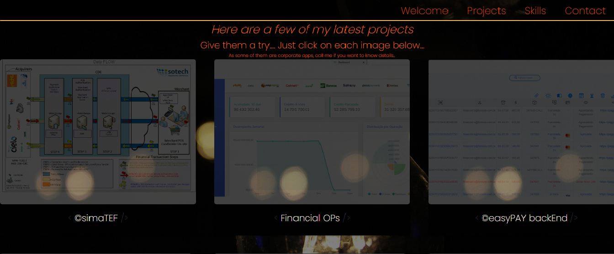

## Hi! Have you already coded today?! :superhero: :brazil:


### About Me :sunglasses:
Hi everyone! I am a Full Stack Web Applications Developer, designing, coding and supporting the lifecycle of cloud-based payment applications using languages and frameworks such as Laravel, PHP, JS, HTML, CSS, Bootstrap, Java, Spring Boot, code version control as Git, SQL and NoSQL databases as MySQL, MongoDB and tools such as Docker, Portainer, Kubernetes, Nginx, CI/CD tools as Jenkins, SonarQube, Selenium working fulltime as a Sr Software Engineer for a digital payments services provider for the past years doing ...

- Software Engineering
- Systems Architecture
- Object-Oriented Programming
- Hands-on Coding Apps
- Constant Integration and Delivery
- Supporting Applications Lifecycle
- Writing Clean Code using Design Patterns as SOLID, MVC, etc
- Providing support to DevOps and Tech Support teams

If you want to go down to the nitty-gritty of my challenging career as a solutions developer drop me a quick message, clicking on the social media icons shown below or even take a look at my current Resume :scroll: [https://ferreiras.dev.br/cv/ResumeRicardoFerreira.pdf]
## _Table of contents_
- [Overview](#overview)
- [Screenshot](#screenshot)
- [Links](#links)
- [Built with](#built-with)
- [How I did it](#how-I-did-it)
- [Author](#author)
## _Overview_
The design is structured as shown:
- assets|
    - css|
        - style.css
    - images|
    - cv
- index.html

## _Screenshot_
[](https://ferreiras.dev.br)
## _Links_
- Live Site URL: [https://ferreiras.dev.br] 
## _Built with_
| VS Code | Git | CSS3 | HTML5 | CentOS | JavaScript |
|----------|----------|----------|----------|----------|----------|
  |  |  |  |  |  |

## _How I did it_
```html
    <section id="welcome-section" class="welcome-section">
      <div>
        <p>Hi everyone! I am called
        <a href="https://www.ferreiras.dev.br/cv/ResumeRicardoFerreira.pdf" class="contact-details" target="_blank" >
          <span class="waviy">
              <span style="--i:1">R</span>
              <span style="--i:2">i</span>
              <span style="--i:3">c</span>
              <span style="--i:4">a</span>
              <span style="--i:5">r</span>
              <span style="--i:6">d</span>
              <span style="--i:7">o</span>
              <span style="--i:8"></span>
              <span style="--i:9">F</span>
              <span style="--i:10">e</span>
              <span style="--i:11">r</span>
              <span style="--i:12">r</span>
              <span style="--i:13">e</span>
              <span style="--i:14">i</span>
              <span style="--i:15">r</span>
              <span style="--i:16">a</span>
          </span></a>
      </div>
``` 
```css
.gallery {
  overflow-x: scroll;
  overflow-y: hidden;
  scroll-snap-type: x mandatory;
  scroll-behavior: smooth;
  display: flex;

  @media screen and (min-width: 960px) {
    display: block;
    overflow-y: scroll;
    overflow-x: hidden;
    scroll-snap-type: y mandatory;
  }
}
``` 
## _Author_
- Website - [https://ferreiras.dev.br] 


